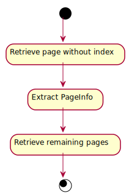
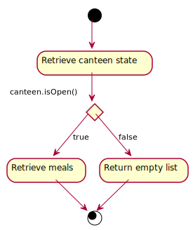

_This is an assignment to the class [Programmieren 3](https://hsro-inf-prg3.github.io) at the [University of Applied Sciences Rosenheim](http://www.fh-rosenheim.de)._

# Assignment 11: Futures - Android variant

This assignment covers the more advanced multithreading topic _futures_ and _future chaining_.
Futures are a feature of Java 8 and can be compared to the concept of _promises_ in JavaScript.

The internet contains lots of good articles about `Future<>` and `CompletableFuture<>` in Java.
For example [this one](http://www.deadcoderising.com/java8-writing-asynchronous-code-with-completablefuture/) covers everything you need to know for this assignment.

_This is the Android variant of the assignment. There's also an [CLI variant](https://github.com/hsro-inf-prg3/11-futures-cli) which covers the same concepts. **You don't have to implement both!** If you want to switch between them you should be able to copy most of the code you already wrote (except a few platform adoptions)._

## Setup

1. Create a fork of this repository (button in the right upper corner)
1. Clone the project (get the link by clicking the green _Clone or download button_)
1. Import the project to your **Android Studio**

_Remark: the given unit tests won't succeed until you have completed the first part of this assignment as they require the `CompletableFuture<>` Call Adapter registered in Retrofit!_

## Retrofit Call Adapter

To be able to use the given `OpenMensaAPI` interface with Retrofit you have to do some extra work.
Retrofit is able to return `CompletableFuture<>` but you have to register a [Call Adapter](https://github.com/square/retrofit/wiki/Call-Adapters) to enable this feature.

To accomplish this you have to include another dependency in the `build.gradle`-file and register the adapter within the Retrofit builder (`.addCallAdapterFactory(...)`).

To validate that the Call Adapter is registered correctly run the given unit tests.
They're also a good starting point to get an idea how to use the API with `Future<>`s instead of the Retrofit specific `Call<>` objects.

## Retrieving all canteens

The `Spinner` in the given Android application is for selecting the canteen you want to fetch the meals for.
This `Spinner` has to be initialized by fetching all canteens the OpenMensa API is aware of.

Therefore the `MainActivity` already contains an empty method `initCanteensSpinner()` which should fetch all available canteens and put them into the `ArrayAdapter<>` instance `canteenAdapter`.

The following flow chart shows how to proceed:

### Retrieve the first page of canteens

Use the method `getCanteens()` of the OpenMensaAPI to retrieve the fist page of canteens (without index).
The method returns an object of `Response<List<Canteen>>`.
That might be a little bit confusing but the OpenMensaAPI does not expose a dedicated pagination endpoint to retrieve the total count of items or the total count of pages but exposes this information in the response headers (`X-Total-Pages`, `X-Total-Count`, ...).
To be able to extract this information you need the `Response<>` wrapper because the wrapper includes a reference to the headers.

### Extract the pagination information

There's a given utility class `PageInfo` which extracts the pagination information from a generic `Response<>` object. To create a `PageInfo` instance use the static factory method `PageInfo.extractFromResponse(...)`.

### Retrieve the remaining pages

When you have the pagination information extracted you can retrieve the remaining pages with the method `getCanteens(int pageNumber)` of the OpenMensaAPI.
As always there's not **one** solution but different ways to accomplish this!
But no matter which approach you're chosing you have to collect all retrieved canteens in one list and pass this list to the `ArrayAdapter<>` instance `canteenAdapter` (e.g. in a `.thenAccept(...)`).

_Side note: to keep the app as simple as possbile (well, actually it is not really simple, but we tried!) it does not contain a progressbar which shows if the canteens have been loaded or not so it might be a good idea to show a `Toast` when the initialization is complete._

## Retrieve the meals of a day

When a canteen was selected the meals for this canteen and the currently selected date (default today) should be retrieved.
The `Spinner` class offers an `OnItemSelectedListener` interface which is already added to the `MainActivity`.
To be able to access the selected canteen later on you have to save it to a `private` variable whenever the selection changes and the `onItemSelected(...)` method is called.

When you have completed the handler (3 lines of code!) you are ready to fetch the meals by implementing the method `updateMeals()`.

The following flow chart shows how to proceed:

### Retrieve the canteen state

At first you have to validate that a canteen was selected and correctly saved in your `private` variable.
If a canteen was selected you have to fetch the state of the canteen at the selected date.

_Hint: to format the date appropriately use the following snippet: `dateFormat.format(currentDate.getTime())`._

### Retrieve the meals

When you retrieved the state of the canteen and it is open at the specified date you can fetch the meals for the same params as you already used to fetch the state.
If the canteen is closed return an empty list so you don't have to check for null values when you pass the meals to the view.
To display the retrieved meals pass them to the `mealsListAdapter` (use the methods `clear()` and `addAll(...)`.